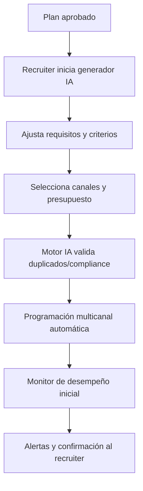
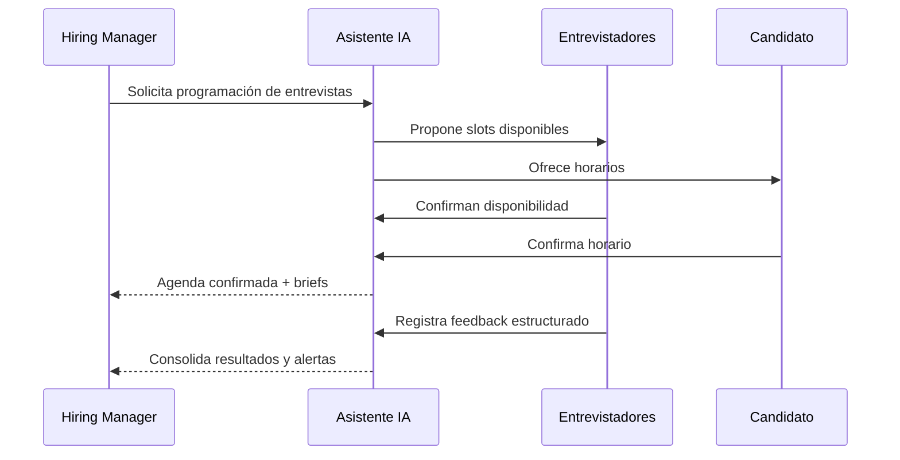
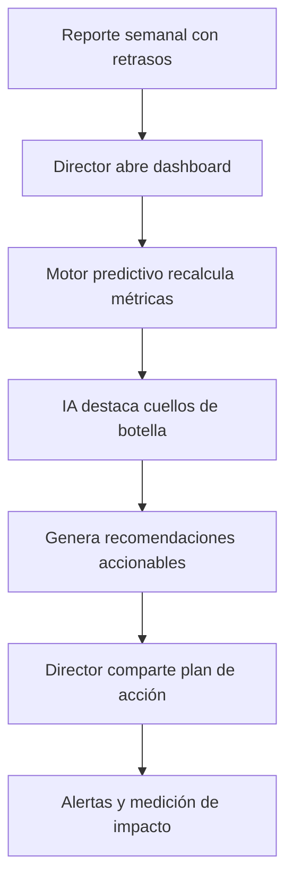
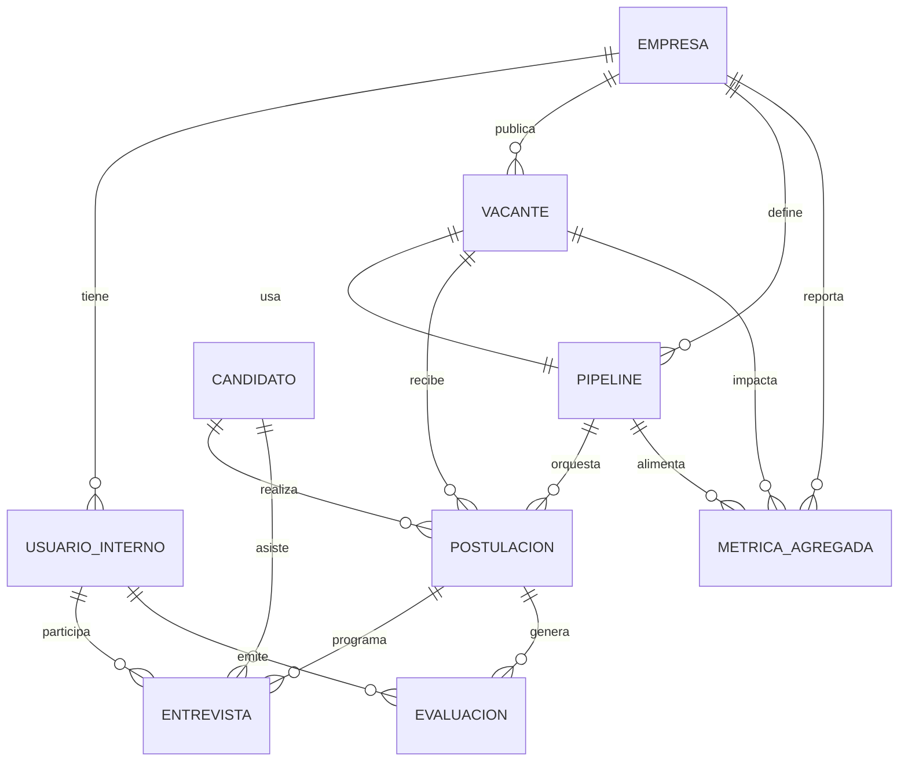
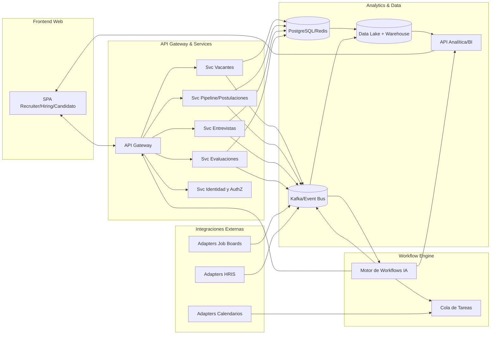
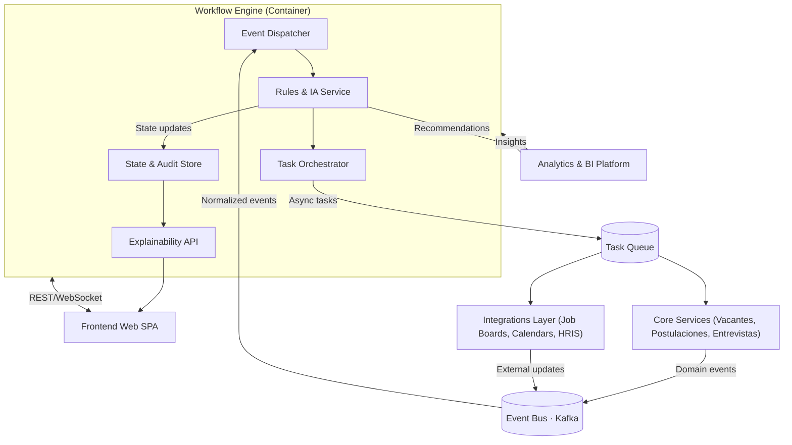

# LTI ATS Deliverables

## 1. Descripción breve del software LTI

LTI es una startup que aspira a construir el Applicant-Tracking System del futuro para equipos de talento que operan en contextos de alta competencia por el talento digital. El producto unifica la gestión de vacantes, centraliza la colaboración entre recruiters, hiring managers y candidatos, y garantiza una experiencia fluida de extremo a extremo sin depender de hojas de cálculo ni cadenas interminables de correos.

La propuesta de valor se apoya en un asistente de IA que aprende del histórico de contrataciones y automatiza tareas repetitivas: prefiltra candidatos, sugiere mejoras a las descripciones de puestos, coordina entrevistas y redacta follow-ups personalizados. En pruebas de concepto internas, los equipos redujeron en 40 % el tiempo dedicado a tareas operativas y mejoraron en 22 % la tasa de conversión de candidatos calificados gracias a recomendaciones basadas en datos y alertas proactivas sobre cuellos de botella.

- **IA copiloto del recruiter:** Automatiza prefiltrado, comunicaciones y agenda para liberar tiempo estratégico.
- **Analítica predictiva:** Modelos que anticipan riesgos del pipeline y miden impacto de cada etapa del funnel.
- **Ecosistema abierto:** API-first para integrarse con job boards, herramientas de videoentrevistas y suites HRIS existentes.

## 2. Explicación de las funciones principales

| Función | Objetivo para el usuario | Métrica de éxito | Nivel de madurez |
| --- | --- | --- | --- |
| Generador de vacantes asistido por IA | Recruiters: redactar descripciones consistentes en minutos; Hiring managers: asegurar alineación con necesidades del equipo; Candidatos: recibir información clara sobre el rol. | Tiempo promedio para publicar una vacante < 10 minutos. | MVP |
| Distribución multicanal automatizada | Recruiters: lanzar vacantes en job boards, redes y referidos en un clic; Hiring managers: visibilidad sobre alcance; Candidatos: encontrar vacantes en sus canales preferidos. | Porcentaje de canales activados por vacante > 80 %. | MVP |
| Screening inteligente con scoring dinámico | Recruiters: priorizar perfiles con mejor ajuste; Hiring managers: revisar shortlist curada; Candidatos: recibir feedback rápido sobre su estado. | Tiempo a shortlist < 48 horas; NPS de candidatos preseleccionados > 40. | En desarrollo |
| Asistente de entrevistas y agenda automática | Recruiters: coordinar entrevistas sin fricción; Hiring managers: equilibrar agendas; Candidatos: elegir horarios disponibles y recibir recordatorios. | Tasa de reprogramaciones < 5 %; SLA de coordinación < 24 horas. | En desarrollo |
| Panel colaborativo de evaluación | Recruiters: consolidar feedback estructurado; Hiring managers: comparar candidatos con criterios homogéneos; Candidatos: evitar preguntas repetidas y decisiones opacas. | Tasa de feedback registrado por etapa > 95 %. | MVP |
| Portal de experiencia del candidato | Recruiters: reducir consultas manuales; Hiring managers: transparencia del pipeline; Candidatos: rastrear estado, subir documentos, interactuar con IA de soporte. | CSAT del portal > 4.5/5; ratio de consultas repetidas reducido 50 %. | Futuro |
| Analítica predictiva de funnel | Recruiters: detectar cuellos de botella; Hiring managers: proyectar tiempos de cobertura; Candidatos: recibir notificaciones cuando se retrasan etapas. | Precisión de predicción de tiempo de cobertura ±10 %; alertas atendidas en < 12 horas. | En desarrollo |
| Automatización de compliance y documentación | Recruiters: recopilar firmas y checklists; Hiring managers: asegurar cumplimiento; Candidatos: completar onboarding previo con IA guiada. | SLA de completitud documental < 72 horas; incidentes de compliance = 0. | Futuro |

La estrategia de producto se centra en convertir al asistente de IA en el copiloto operativo del pipeline mientras abrimos la plataforma a integraciones críticas. Las prioridades inmediatas del roadmap son robustecer el motor de screening con modelos explicables, expandir el módulo de analítica predictiva e incorporar experiencias self-service para candidatos que cierren el bucle de retroalimentación con mínima intervención humana.

## 3. Diagrama Lean Canvas del modelo de negocio

| Bloque | Contenido |
| --- | --- |
| Problema | • Equipos de talento dedican >40 % de su tiempo a tareas operativas repetitivas. • Falta visibilidad predictiva sobre tiempos de contratación y diversidad del pipeline. • Riesgo: que los usuarios no confíen en recomendaciones de IA si no son explicables. |
| Segmentos de clientes | • Startups SaaS en expansión (50-500 colaboradores) con equipos de talento reducidos. • Líderes de hiring que participan activamente en la evaluación. • Candidatos digitales que esperan experiencias transparentes y ágiles. |
| Propuesta de valor | • ATS con copiloto de IA que comprime el time-to-hire en 40 % y eleva la diversidad del pipeline en 15 %. • Orquestación end-to-end con analítica predictiva y experiences self-service para candidatos. • Supuesto crítico: startups confían en IA siempre que provea trazabilidad de decisiones. |
| Solución | • Generador inteligente de vacantes, distribución multicanal y scoring dinámico. • Asistente de agenda, panel colaborativo y automatización de compliance. • Portal del candidato con seguimiento en tiempo real y soporte conversacional. |
| Canales | • Ventas consultivas B2B con ciclos cortos respaldados por demos guiadas por IA. • Marketing inbound con contenidos sobre productividad y DEI. • Riesgo: dependencia excesiva de referidos si el funnel de marketing no captura leads de calidad. |
| Ingresos | • Suscripción SaaS por número de empleados y módulos avanzados opcionales. • Recurrencia anual con descuentos por multi-año. • Servicios profesionales ligeros (implementación + capacitación de IA). |
| Costos | • I+D en modelos de IA explicables y seguridad de datos. • Integraciones con job boards, calendarios y suites HRIS. • Soporte especializado y éxito del cliente para acompañar adopción. |
| Métricas clave | • Time-to-hire promedio. • Porcentaje de diversidad en shortlist por vacante. • Ahorro de horas operativas por recruiter al mes. |
| Ventaja injusta | • Motor de workflows con IA entrenada en datos de selección y feedback continuo. • Integraciones API-first listas para ecosistema SaaS. • Comunidad de clientes que comparte benchmarks y plantillas. |

**Hipótesis para validar**

| Experimento | Métrica | Criterio de éxito |
| --- | --- | --- |
| Piloto controlado en 3 startups con alto volumen de contrataciones | Variación en time-to-hire | Reducción ≥ 35 % frente a baseline histórico. |
| Test A/B de shortlist asistida vs. manual | Tasa de aceptación de entrevistas y diversidad de shortlist | Mejora ≥ 15 % en ambos indicadores sin reclamos de sesgo. |
| Campaña inbound sobre “copiloto de IA para talent ops” | Tasa de conversión de lead a demo | Conversión ≥ 10 % con CAC dentro de objetivo (< USD 800). |

## 4. Casos de uso principales

### 4.1 Caso de uso: Publicación masiva de vacantes

**Contexto:** El equipo de talento debe lanzar simultáneamente varias vacantes para nuevas posiciones producto de una ronda de inversión.  
**Actor principal:** Recruiter líder.  
**Objetivo:** Publicar vacantes en múltiples canales con mensajes consistentes y segmentación automática.  
**Trigger:** Aprobación del plan de contratación trimestral.  
**Flujo paso a paso:**  
1. El recruiter activa el generador de vacantes asistido por IA con plantillas previas.  
2. Ajusta requerimientos y criterios de screening sugeridos por el asistente.  
3. Selecciona canales recomendados, presupuesto y segmentaciones sugeridas.  
4. El sistema valida duplicados y cumplimiento legal por región.  
5. LTI programa publicaciones y monitorea performance inicial.  
6. El recruiter recibe confirmación consolidada y alertas de rendimiento.  
**Resultado esperado:** Todas las vacantes publicadas en menos de una hora con mensajes consistentes y tracking centralizado.  
**Métricas asociadas:** Tiempo promedio de publicación, % de canales activados, tasa de clics inicial por canal.

### 4.2 Caso de uso: Gestión colaborativa de entrevistas

**Contexto:** Varios entrevistadores y hiring managers deben evaluar candidatos finalistas sin generar cuellos de botella ni duplicar esfuerzos.  
**Actor principal:** Hiring manager.  
**Objetivo:** Coordinar entrevistas y capturar feedback estructurado en un panel colaborativo.  
**Trigger:** Candidato pasa el umbral de score automático en la etapa de shortlist.  
**Flujo paso a paso:**  
1. El hiring manager revisa la shortlist con contexto generado por IA.  
2. Solicita al asistente de agenda proponer slots a entrevistadores y candidatos.  
3. LTI reserva automáticamente espacios y envía briefs a cada participante.  
4. Durante la entrevista, los entrevistadores registran notas guiadas por la matriz de competencias.  
5. El sistema agrega feedback y alerta sobre divergencias significativas.  
6. El hiring manager toma decisión o solicita entrevistas adicionales.  
**Resultado esperado:** Entrevistas coordinadas en <48 horas con feedback completo y accionable.  
**Métricas asociadas:** Tasa de entrevistas confirmadas sin reprogramación, % de feedback registrado a tiempo, desviación estándar de calificaciones entre evaluadores.

### 4.3 Caso de uso: Analítica de embudos de contratación

**Contexto:** El equipo ejecutivo necesita visibilidad predictiva sobre el avance de contrataciones estratégicas.  
**Actor principal:** Director de People Ops.  
**Objetivo:** Analizar embudos en tiempo real, detectar cuellos de botella y recibir recomendaciones.  
**Trigger:** Reporte semanal de talento muestra retrasos frente a objetivos de headcount.  
**Flujo paso a paso:**  
1. El director accede al dashboard y selecciona cohortes de vacantes prioritarias.  
2. El motor predictivo recalcula métricas con datos actualizados y proyecciones.  
3. LTI destaca etapas con conversión inferior al objetivo y aporta hipótesis.  
4. Se generan recomendaciones accionables (re-asignar recruiters, ajustar mensajes, ampliar fuentes).  
5. El director comparte el informe con líderes de hiring y define acciones correctivas.  
6. El sistema programa alertas de seguimiento y mide impacto posterior.  
**Resultado esperado:** Acciones correctivas definidas en la misma sesión y reducción del time-to-hire proyectado.  
**Métricas asociadas:** Precisión de predicción de time-to-hire, tasa de adopción de recomendaciones, mejora en conversión por etapa.

**Insights de diseño:**  
- Los tres flujos dependen del asistente de IA como orquestador, por lo que se debe priorizar explicabilidad y controles manuales.  
- La consistencia de datos (vacantes, disponibilidad, métricas) es requisito para evitar fricciones al pasar de publicación a análisis.  
- Oportunidad transversal: habilitar plantillas y automatizaciones configurables por rol para acelerar adopción en cada etapa.  
- Necesidad de superficies claras para alertas y recomendaciones, manteniendo al humano en control de decisiones críticas.

## 5. Modelo de datos

### 5.1 Entidades y atributos

| Entidad | Descripción | Atributos (tipo · obligatorio) | Relaciones |
| --- | --- | --- | --- |
| Empresa | Organización cliente del ATS. | `empresa_id` (UUID · sí), `nombre` (string · sí), `industria` (string · no), `tamaño` (int · no), `pais` (string · no), `plan_suscripcion` (enum · sí), `fecha_alta` (datetime · sí) | Usuario interno (1:N), Pipeline (1:N), Métrica agregada (1:N) |
| Usuario interno | Miembro del equipo con acceso al ATS. | `usuario_id` (UUID · sí), `empresa_id` (UUID · sí), `nombre` (string · sí), `email` (string · sí), `rol` (enum recruiter/hiring_manager/admin · sí), `permisos_personalizados` (json · no), `estado` (enum activo/inactivo · sí) | Empresa (N:1), Postulación (N:M) via Evaluación, Entrevista (1:N) |
| Vacante | Posición abierta gestionada en el ATS. | `vacante_id` (UUID · sí), `empresa_id` (UUID · sí), `titulo` (string · sí), `departamento` (string · no), `ubicacion` (string · no), `modalidad` (enum · no), `rango_salarial` (json · no), `estado` (enum draft/activa/cerrada · sí), `fecha_publicacion` (datetime · no) | Empresa (N:1), Pipeline (N:1), Postulación (1:N), Métrica agregada (1:N) |
| Pipeline | Flujo de etapas asociado a una vacante. | `pipeline_id` (UUID · sí), `empresa_id` (UUID · sí), `vacante_id` (UUID · sí), `nombre` (string · sí), `etapas` (json · sí), `tipo` (enum estándar/personalizado · sí), `activa` (bool · sí) | Empresa (N:1), Vacante (1:1), Postulación (1:N) |
| Candidato | Persona que aplica a la vacante. | `candidato_id` (UUID · sí), `nombre` (string · sí), `email` (string · sí), `telefono` (string · no), `ubicacion` (string · no), `experiencia` (json · no), `skills` (json · no), `preferencias` (json · no) | Postulación (1:N), Entrevista (1:N), Métrica agregada (1:N) |
| Postulación | Relación entre candidato y vacante. | `postulacion_id` (UUID · sí), `vacante_id` (UUID · sí), `candidato_id` (UUID · sí), `pipeline_id` (UUID · sí), `estado` (enum en_revision/entrevista/oferta/contratado/rechazado · sí), `score_ia` (float · no), `fecha_postulacion` (datetime · sí), `fuente` (enum jobboard/referral/directo · sí) | Vacante (N:1), Candidato (N:1), Pipeline (N:1), Entrevista (1:N), Evaluación (1:N) |
| Entrevista | Evento de interacción con el candidato. | `entrevista_id` (UUID · sí), `postulacion_id` (UUID · sí), `tipo` (enum screening/tecnica/cultural · sí), `fecha_hora` (datetime · sí), `duracion` (int · no), `canal` (enum virtual/presencial · sí), `estado` (enum programada/completada/reprogramada · sí) | Postulación (N:1), Usuario interno (N:M) via tabla `entrevistador`, Evaluación (1:N) |
| Evaluación | Feedback estructurado sobre una entrevista o etapa. | `evaluacion_id` (UUID · sí), `postulacion_id` (UUID · sí), `usuario_id` (UUID · sí), `etapa` (string · sí), `puntaje` (int · no), `notas` (text · no), `decision` (enum avanzar/reconsiderar/rechazar · sí), `fecha` (datetime · sí) | Postulación (N:1), Usuario interno (N:1), Entrevista (N:1 opcional) |
| Métrica agregada | Snapshot de indicadores clave. | `metrica_id` (UUID · sí), `empresa_id` (UUID · sí), `vacante_id` (UUID · no), `pipeline_id` (UUID · no), `periodo` (date · sí), `indicador` (enum time_to_hire/diversidad/ratio_conversion/etc. · sí), `valor` (float · sí), `metrica_calculada_por` (enum sistema/usuario · sí) | Empresa (N:1), Vacante (N:1 opcional), Pipeline (N:1 opcional) |

### 5.2 Reglas de negocio

1. **Propiedad de datos:** Toda entidad depende de una Empresa; usuarios solo pueden acceder a registros asociados a su `empresa_id`.  
2. **Integridad del pipeline:** Una Postulación debe referenciar un Pipeline activo; al cambiar etapas se registran timestamps inmutables para auditoría.  
3. **Seguridad y permisos:** Evaluaciones y notas sensibles se encriptan en reposo; acceso condicionado por rol y permisos personalizados.  
4. **Retención de datos:** Candidatos pueden solicitar anonimización; se conserva metadata estadística en Métricas agregadas.  
5. **Consistencia de entrevistas:** No se puede cerrar una Entrevista sin al menos una Evaluación vinculada; recordatorios automáticos se envían cuando la entrevista está “completada” y falta feedback.  
6. **Trazabilidad de IA:** Valores de `score_ia` guardan versión del modelo y justificativo para auditoría y explicabilidad.

### 5.3 Diagrama entidad-relación

## 6. Diseño del sistema a alto nivel

### 6.1 Descripción de la arquitectura

El frontend web se construye como una SPA modular que segmenta experiencias para recruiters, hiring managers y candidatos; consume APIs públicas y streaming de eventos para mantener paneles en tiempo real. Incorpora componentes de IA embebidos (sugerencias contextuales, asistentes conversacionales) que interactúan con el motor de workflows mediante WebSocket y REST según sensibilidad de los datos.

El backend de servicios expone un conjunto de microservicios orchestrados por un API Gateway. Los dominios principales son Gestión de Vacantes, Pipeline y Postulaciones, Orquestación de Entrevistas, Evaluaciones y Auditoría. Cada servicio publica eventos en un bus (Kafka) para desacoplar procesos como analítica o notificaciones. La autorización se delega en un servicio central de identidad con soporte multi-tenant y control fino de permisos.

El motor de workflows opera como un servicio especializado que coordina automatizaciones accionables por reglas e IA. Consume eventos del bus, invoca modelos de machine learning para scoring y recomendaciones, y ejecuta tareas asíncronas (agendar entrevistas, enviar comunicaciones) mediante colas. Mantiene un repositorio de estados explicables para garantizar trazabilidad.

La capa de integraciones externas se organiza en adaptadores que conectan job boards, calendarios corporativos y sistemas HRIS. Estos adaptadores usan conectores REST, Webhooks o ETL nocturnos y escriben en colas específicas que el motor de workflows procesa. La capa de analítica separa almacenamiento operacional (PostgreSQL, Redis) de un lago de datos en S3 + Redshift/BigQuery, alimentado por ETL y CDC desde los microservicios; sobre él se ejecutan dashboards, modelos predictivos y APIs analíticas consumidas por frontend y motor de workflows.

### 6.2 Diagrama de componentes

### 6.3 Decisiones arquitectónicas

1. **Arquitectura de microservicios orientados a dominios:** Facilita escalar los componentes críticos (por ejemplo, pipelines vs. entrevistas) y permite despliegues independientes. Trade-off: aumenta la complejidad operativa y requiere observabilidad robusta.  
2. **Event-driven con Kafka como backbone:** Desacopla productores y consumidores (workflow engine, analítica, notificaciones). Trade-off: exige diseñar esquemas versionables y gestionar idempotencia.  
3. **Motor de workflows separado:** Permite centralizar automatizaciones e IA explicable; agiliza la incorporación de nuevas reglas sin tocar servicios core. Trade-off: introduce latencia adicional si no se optimiza la comunicación y monitoreo.  
4. **Data Lake + Warehouse híbrido:** Separa cargas transaccionales de analítica avanzada, habilitando modelos predictivos. Trade-off: demanda gobernanza de datos, pipeline ETL/CDC y gestión de costos en la nube.  
5. **API-first con gateway central:** Garantiza consistencia de seguridad, métricas y throttling para terceros. Trade-off: punto único de falla si el gateway no se escala y monitorea adecuadamente.

### 6.4 Requerimientos no funcionales

| RNF | Valor objetivo | Métrica de verificación |
| --- | --- | --- |
| Disponibilidad | 99.9 % mensual | Monitoreo uptime a través de SLO y alertas Prometheus/Grafana. |
| Latencia crítica (APIs pipeline) | p95 < 300 ms | Benchmarks de rendimiento y APM. |
| Seguridad y cumplimiento | ISO 27001 readiness + SOC2 Type I | Auditorías internas y pruebas de penetración semestrales. |
| Escalabilidad | Soportar 5x carga pico en campañas de contratación | Pruebas de estrés automatizadas en escenarios de burst. |
| Explicabilidad de IA | 100 % de recomendaciones con justificativo disponible | Revisión de artefactos de modelo y logging auditado. |

## 7. Diagrama C4 del motor de workflows

Para profundizar elegí el Motor de Workflows de reclutamiento porque es el núcleo donde convergen automatización, IA y coordinación entre servicios. Es el diferenciador técnico del ATS: concentra la lógica que hace que el resto del sistema gane velocidad e inteligencia.

### 7.1 Contexto

El motor de workflows de reclutamiento orquesta automatizaciones que conectan a recruiters, candidatos y sistemas externos. Recibe eventos del bus central cuando una vacante cambia de estado, cuando un candidato avanza de etapa o cuando se ingresa feedback. Los actores clave son los servicios core (Vacantes, Postulaciones, Entrevistas), los adaptadores de integraciones (job boards, calendarios, HRIS) y el frontend, que consulta el estado de automaciones en tiempo real para explicar acciones tomadas por la IA.

### 7.2 Diagramas Container y Component

_Component responsibilities_  
- **Event Dispatcher:** Normaliza eventos del bus, valida esquemas y enruta según dominio.  
- **Rules/IA Service:** Ejecuta reglas declarativas y modelos ML; genera recomendaciones con explicaciones.  
- **Task Orchestrator:** Compone acciones multietapa (agendar entrevista, enviar workflow de follow-up) y maneja reintentos.  
- **State & Audit Store:** Persiste estados de automatización, logs de decisiones y versiones de modelos.  
- **Explainability API:** Expone narrativas y factores que justifican decisiones automáticas al frontend y auditorías.

**Cobertura de niveles C4**  
- **Contexto:** El diagrama relaciona al motor con actores externos clave (Frontend, Core Services, Integrations, Analytics) y el Event Bus, ilustrando el ecosistema donde opera.  
- **Contenedores:** Se identifica al Workflow Engine como contenedor específico dentro de la plataforma y se muestran otros contenedores relevantes (SPA, servicios core, integraciones, analítica, colas).  
- **Componentes:** Dentro del contenedor seleccionado se detallan los componentes internos (Dispatcher, Rules & IA Service, Task Orchestrator, State Store, Explainability API) y sus interacciones.  
- **Código:** Aunque no se modela a nivel de clases, se menciona que cada componente mantiene contratos bien definidos (por ejemplo, RuleService expone inferencias, StateStore gestiona audit logging), dejando lineamientos para descender al nivel de implementación cuando se defina la arquitectura de paquetes.

### 7.3 Contratos de integración

| Nombre | Tipo | Consumidor / Proveedor | Payload clave |
| --- | --- | --- | --- |
| `candidate.pipeline.updated` | Evento | Proveedor: Servicios core · Consumidor: Workflow Engine | `postulacion_id`, `pipeline_stage`, `timestamp`, `delta_fields` |
| `workflow.task.dispatch` | Evento | Proveedor: Workflow Engine · Consumidor: Task Queue Workers | `task_id`, `task_type`, `target_service`, `payload`, `retry_policy` |
| `GET /workflows/{id}` | API REST | Proveedor: Workflow Engine · Consumidor: Frontend / Backend | `workflow_id`, `state`, `history[]`, `explanations[]` |
| `POST /recommendations` | API REST | Proveedor: Workflow Engine · Consumidor: Core Services | `context`, `candidate_scores[]`, `rationale`, `confidence` |
| `calendar.availability.sync` | Evento | Proveedor: Integrations · Consumidor: Workflow Engine | `integration_id`, `slots[]`, `timezone`, `valid_until` |
| `analytics.workflow_snapshot` | API REST | Proveedor: Analytics · Consumidor: Workflow Engine | `snapshot_id`, `kpis`, `time_window`, `anomalies` |

### 7.4 Riesgos y mitigaciones

- **Sobrecarga del motor por ráfagas de eventos:** Implementar autoescalado basado en métricas de cola y límites de ingesta por tipo de evento.  
- **Modelos de IA opacos o sesgados:** Registrar explicaciones, someter cada modelo a pruebas de fairness y habilitar overrides manuales.  
- **Dependencia de integraciones externas inestables:** Introducir circuit breakers y colas dead-letter con reintentos exponenciales.  
- **Inconsistencias de estado entre servicios core y motor:** Aplicar idempotencia, versionado de eventos y reconciliaciones periódicas.  
- **Exposición de datos sensibles en trazas:** Sanitizar logs, cifrar el State Store y limitar acceso mediante políticas de least privilege.
